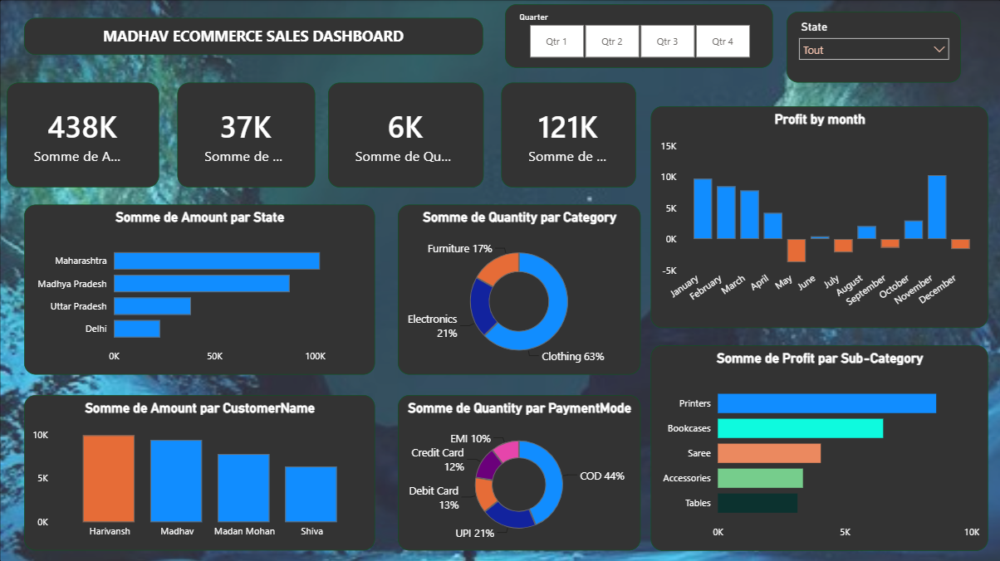

# Madhav Ecommerce Sales Dashboard 📊

An interactive **Power BI dashboard** designed to analyze ecommerce sales performance, customer behavior, product categories, and profitability.

## 📌 Project Overview



This project transforms ecommerce sales data into an interactive business intelligence dashboard using **Microsoft Power BI**.

The dashboard helps users understand key business metrics and identify trends in sales, profit, quantity sold, and customer purchasing behavior.

## 🎯 Business Objectives

* Monitor overall ecommerce sales performance
* Analyze **Sales, Profit, Quantity, and Average Order Value**
* Identify top-performing product categories and sub-categories
* Understand customer purchasing patterns
* Analyze monthly and regional sales trends
* Identify profitable and underperforming areas
* Support data-driven business decision-making

## 📊 Key Dashboard Insights

The dashboard provides analysis of:

* **Total Sales**
* **Total Profit**
* **Total Quantity Sold**
* **Average Order Value**
* Sales and profit trends over time
* Category and sub-category performance
* Customer and regional performance
* Payment mode analysis
* Profitability analysis

## 🛠️ Tools & Technologies

* **Microsoft Power BI**
* **Power Query** – Data cleaning and transformation
* **DAX** – Calculated measures and business metrics
* **Data Visualization** – Interactive charts, cards, slicers, and graphs

## 🔄 Project Workflow

```text
Raw Ecommerce Data
        ↓
Data Cleaning & Transformation
        ↓
Data Modeling
        ↓
DAX Measures & Calculations
        ↓
Interactive Power BI Dashboard
        ↓
Business Insights
```

## 📈 Dashboard Features

### KPI Analysis

Provides a quick overview of important business metrics such as sales, profit, quantity, and average order value.

### Sales Analysis

Allows users to analyze sales performance across different periods and identify trends.

### Product Analysis

Helps identify high-performing and low-performing categories and sub-categories.

### Customer Analysis

Provides insights into customer purchasing behavior and sales contribution.

### Regional Analysis

Enables comparison of sales and profitability across different regions.

### Interactive Filtering

Users can interact with the dashboard using filters and slicers to explore specific segments of the data.

## 📂 Repository Contents

| File                                    | Description             |
| --------------------------------------- | ----------------------- |
| `Madhav_Ecommerce_Sales_Dashboard.pbix` | Power BI dashboard file |
| `README.md`                             | Project documentation   |

## 🚀 How to Use

1. Download the `.pbix` file from this repository.
2. Open it using **Microsoft Power BI Desktop**.
3. Interact with the dashboard using the available filters and slicers.
4. Explore sales, profit, customer, product, and regional insights.

> **Note:** Power BI Desktop is required to open and interact with the `.pbix` file.

## 💡 Skills Demonstrated

This project demonstrates practical skills in:

* Data Analysis
* Business Intelligence
* Data Cleaning
* Data Transformation
* Data Modeling
* DAX
* Power BI
* Data Visualization
* KPI Development
* Business Reporting
* Interactive Dashboard Design

## 👨‍💻 Author

**Hardy Pipaliya**

This project was created as part of my data analytics and business intelligence portfolio.

---

⭐ If you find this project useful, feel free to explore the dashboard and repository.

